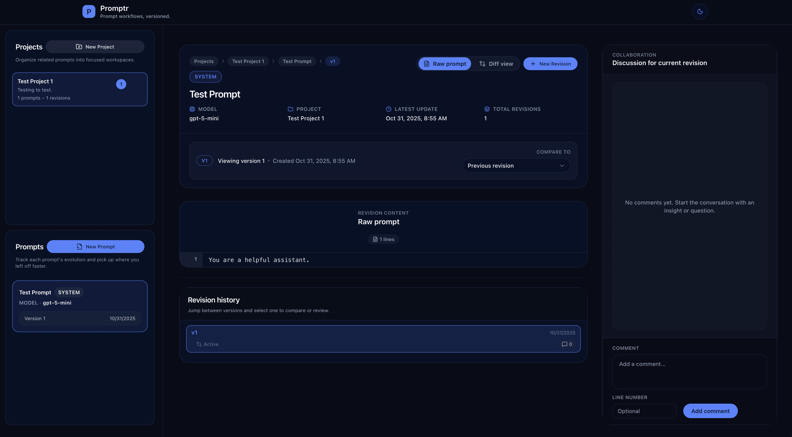
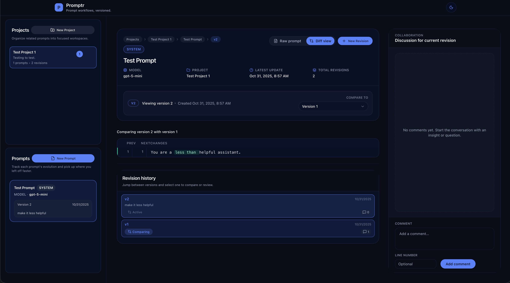
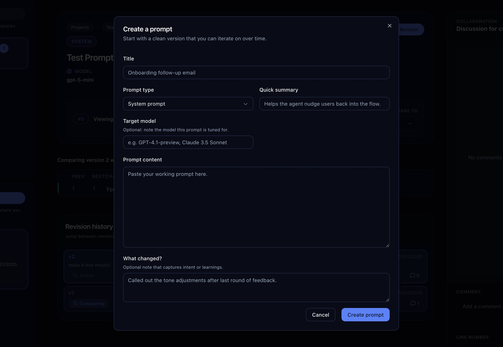

# Promptr

> Organize, iterate, and compare your prompt engineering workflows from a single workspace.

Promptr keeps every prompt, revision, and discussion in one place so teams can move faster from idea to production. It bundles opinionated tooling for tracking prompt history, diffing revisions, leaving contextual feedback, and keeping metadata in sync with your projects.







## Highlights
- Project-centric workspace to group related prompts with summaries and activity stats.
- Versioned prompt history with automatic revision numbering, change logs, and metadata such as model and prompt type.
- Rich diff view to compare any two revisions side by side, alongside a raw prompt viewer with line numbers.
- Discussion threads with optional line references, timestamps, and resolution state for every revision.
- Offline-first SQLite database (via `better-sqlite3`) that lives next to the app and is easy to back up or swap.
- Built with Next.js 16 App Router, React Server Components, Tailwind CSS, and shadcn/ui for a polished, responsive UI.

## Tech Stack
- Next.js 16.0.0 (App Router, React Server Components) running on React 19.2.0 and TypeScript 5.9.3.
- Tailwind CSS 3.4.18 + shadcn/ui primitives (Radix UI 1.x) for interface elements.
- Drizzle ORM 0.44.6 with SQLite via `better-sqlite3` 12.4.1 for local data storage and migrations.
- ESLint 9.38.0, PostCSS 8.5.6, and Autoprefixer 10.4.21 for linting and build tooling.

## Getting Started
### Prerequisites
- Node.js 20+ (Next.js 16 targets the active LTS release).
- npm (ships with Node) or an alternative package manager.
- No external database is required; SQLite files are created locally.

### Installation
```bash
git clone https://github.com/synfinner/Promptr
cd promptr
npm install
```

### Prepare the database
Promptr stores data in `./data/promptr.db`. The baseline schema is bundled with the app, so a fresh install can start immediately—no manual migration step required. The SQLite file is created on demand the first time you run Promptr. If you customize the schema, you can still generate and apply your own migrations with Drizzle.

### Run the app
```bash
npm run dev
```
The development server binds to `0.0.0.0`, so other devices on your network can access it at `http://<your-ip>:3000`.

## Environment Variables
Promptr works out of the box, but you can override the default database settings:
- `DATABASE_DIRECTORY` – Directory where the SQLite file is stored. Defaults to `<project-root>/data`.
- `DATABASE_FILE` – Absolute path to the database file. Defaults to `<DATABASE_DIRECTORY>/promptr.db`.
- `DATABASE_MIGRATE_ON_BOOT` – Run Drizzle migrations automatically on startup when set to `true`. Useful for fresh containers.

Set these variables in a `.env.local` file or your preferred configuration system before running the app.

## Database Workflows
- `npm run db:generate` – Generate a new SQL migration from the TypeScript schema (`src/db/schema.ts`).


Generated migrations live under `drizzle/migrations/`. They can be checked into version control for reproducible environments.

## Project Structure
- `src/app/(app)/page.tsx` – Dashboard page that wires the project sidebar, prompt list, and active prompt details.
- `src/app/(app)/actions.ts` – Server actions that create projects, prompts, revisions, and comments with validation via Zod.
- `src/components/prompts/prompt-detail-client.tsx` – Client UI for diffing revisions, adding comments, and viewing metadata.
- `src/components/projects/project-sidebar.tsx` – Project navigator with activity summaries and quick creation dialog.
- `src/db/schema.ts` – Drizzle ORM table definitions for projects, prompts, revisions, and comments.
- `src/server/queries.ts` – Data fetching helpers used by the App Router components.

## NPM Scripts
- `npm run dev` – Start the Next.js development server on `0.0.0.0`.
- `npm run build` – Create an optimized production build.
- `npm run start` – Serve the production build (also binds to `0.0.0.0`).
- `npm run lint` – Run ESLint over the codebase.
- `npm run db:generate` – Scaffold a Drizzle migration from the current schema.
- `npm run db:push` – Apply migrations if you generate custom SQL.

## Deployment
### Node runtime
1. Build the app locally or in CI:
   ```bash
   npm run build
   ```
2. Ensure the target environment has access to the SQLite file. Copy `data/promptr.db` or point `DATABASE_FILE` to a writable location.
3. Start the server:
   ```bash
   npm run start
   ```

### Docker
Package the app with the included `Dockerfile`:
```bash
docker build -t promptr:latest .
```

The container stores its SQLite database under `/app/data`. Mount that path to persist data between runs:
```bash
docker run --name promptr \
  -p 3001:3000 \
  -e NODE_ENV=production \
  -e DATABASE_DIRECTORY=/app/data \
  -e DATABASE_MIGRATE_ON_BOOT=true \
  -v promptr_data:/app/data \
  promptr:latest
```

Alternatively, use the provided Compose file, which wires up the same environment with a named volume:
```bash
docker compose up --build
```

The Compose file already enables `DATABASE_MIGRATE_ON_BOOT=true` so first-run tables are created automatically.

To keep backups or share the database with the host, swap the named volume for a bind mount:
```yaml
volumes:
  - ./data:/app/data
```

## Using Promptr
- Create a project from the sidebar to start a workspace.
- Add prompts, choose a prompt type (`SYSTEM`, `USER`, or `TOOL`), capture summaries, and store the raw prompt text.
- Capture revisions with change logs. Promptr increments the version number automatically and updates project activity timestamps.
- Compare revisions with the diff viewer or switch to the raw mode for line-numbered review.
- Leave comments with optional line numbers, resolve them as discussions conclude, and use the revision timeline to revisit earlier work.

Promptr is designed to stay lightweight and local-first. Customize the schema, UI, or workflows to tailor it to your team.
